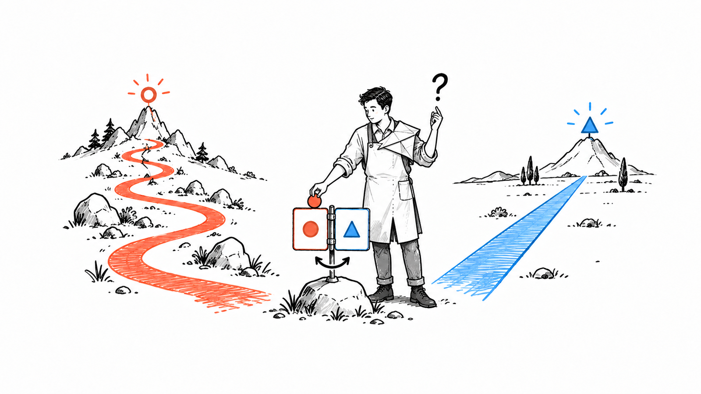

# align-me

**A controlled, human-friendly deep interview for agents.**
Ask only the questions that can change the outcome, explain the tradeoffs, and stop when the human is aligned.

Portable, text-first instructions—not a runtime or permission to act.



## Inspect first

Read `SKILL.md` before use. It defines the two-question ordinary loop, the earned third question, the exceptional six-question cap, recursive high-consequence prerequisites, premise gating, stopping, prototype boundaries, and no-side-effect boundary.

Read `references/strict-aggregate-selection.md` **before offering or accepting** `approve all`. Aggregate selection is optional, fail-closed, one-batch conversational state; it is never execution authority.

The illustration was separately authorized, generated, and QAed through `en-illust` using `gpt-5.6-luna` at max reasoning (the canonical resolution of `5.6-luna-max`). `docs/assets/readme/illustration-brief.md` records the final asset and design requirements; no publication is claimed.

## Manual installation

1. Inspect the host's documentation to find its supported project or user skill directory.
2. Inside that documented directory, create a directory named `align-me`.
3. Copy `SKILL.md` into `align-me/SKILL.md`.
4. Copy `references/strict-aggregate-selection.md` into `align-me/references/strict-aggregate-selection.md`.
5. Copy `LICENSE` into `align-me/LICENSE` to retain the MIT terms and attribution.
6. Follow the host's documented discovery and invocation rules; this package does not install itself, fetch a remote, or promise a universal slash command.

Preserve the relative `references/` path. Do not add a wrapper, runtime service, generated asset, or configuration change as part of installation.

## Use

Ask: “Use align-me to interview me about the first release before we plan it.” Use `/align-me` only where the host supports it. The agent reflects the goal, asks the active gate before ordinary questions, and stops when aligned.

Illustrative, not a captured transcript:
> **Human:** I know the audience and scope. Enough questions.
>
> **Agent:** Keep the first release email-only for existing readers. That reduces delivery work but postpones mobile convenience. We can stop here.

A later plan, implementation, artifact, message, or other side effect always needs its own explicit request and workflow gate. Alignment answers alone are not approval, completion, handoff, or production readiness.

## Checks and evidence

From the repository root, run:

```sh
python3 -B eval/check.py
python3 -B -m unittest discover -s tests
```

See [evaluation evidence](eval/EVIDENCE.md). The evidence separates synthetic fixtures and bounded historical reports from this package: no inherited historical `PASS` is a current semantic proof, and these checks are not a complete model or privacy guarantee. Manual semantic and privacy review remains required.

The public file set is deliberately small: the skill, its strict aggregate reference, this README, the illustration and its documentation, and the repository's evaluation artifacts.

## License and lineage

MIT licensed. [LICENSE](LICENSE) retains this project's contributor notice and **Copyright (c) 2026 Shawn Wang (swyx)** for the MIT-licensed [swyxio/skills align-me](https://github.com/swyxio/skills/blob/main/align-me/SKILL.md). Its material-choice questions, visible options and tradeoffs, recommendations, and aggregate-selection approach overlap with this project's stated lineage; the upstream notice is retained conservatively for possible adapted portions.

[Matt Pocock's grill-me](https://github.com/mattpocock/skills/blob/main/skills/productivity/grill-me/SKILL.md) is conceptual interview lineage, also MIT-licensed (**Copyright (c) 2026 Matt Pocock**). This acknowledgment does not assert copied text. This package uses its own focused stopping rules and non-authorizing boundaries; neither reference implies endorsement.
